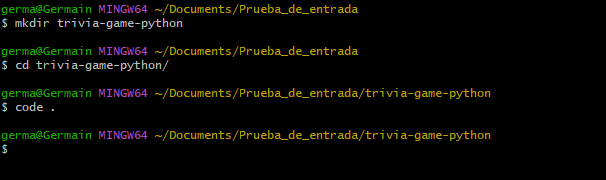
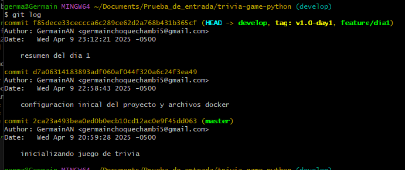

# Prueba de Entrada
---
[Dia 2 >>](EvidenciaDia2.md)
---

## creamos la carpeta

## 1. creando entorno virtual de python

para luegbo instalar  `fastapi uvicorn asyncpg databases`

## 2. creamos los archivos `Dockerfile`  y `docker-compose.yml`

## 3. inicializamos el repositorio y luego creamos ramas

## 4. dockerfile

`FROM` : usamo la imagen oficial de python 3:13

`WORKDIR` : establecemos el directorio de trabjajo dentro del cotenedor /app

`COPY . .` : copia los archivos del directorio local al contenedor

`RUN` : instala las dependencias

 

## 5. docker-compose.yml

## 6. haciendo una fusion con las ramas develop y feature/dia1

## 7. git log

---
[Dia 2 >>](EvidenciaDia2.md)
---