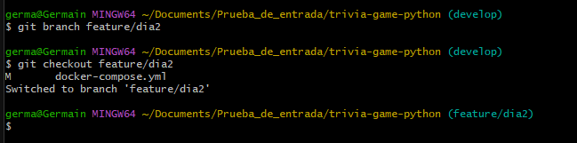

# Dia 2

---
[<< Dia 1](EvidenciaDia1.md) | [Dai 3 >>](EvidenciaDia3.md)
---
## 1. creamos la rama `feature/dia2`

## 2. en la carpeta se crea el archivo trivia.py

par luego prepararlo con `git add .` y despues confirmarlo con `git commit -m` 

## 3. se implementa una prueba basica

instalamos pytest con el comando `pip install pytest`

## 4. ejecutamos la prueba

con el comando `python -m pytest` es para ejecutar las pruebas des la raiz del proyecto

 

## 5. actualizando `dockerfile` y `docker-compose.yml`

## 6. ejecutamos el docker-compose

## 7. aplicando git dif

## 8. aplicando git blame

---
[<< Dia 1](EvidenciaDia1.md) | [Dia 3 >>](EvidenciaDia3.md)
---