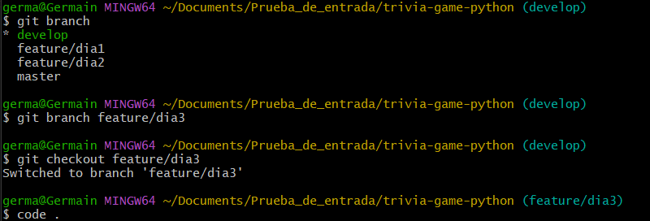

# Dia 3
---
[<< Dia 2](EvidenciaDia2.md) | [Dia 4 >>](EvidenciaDia4.md)
---
## 1. creando la rama `feature/dia3`

## 2. implementando la clase `quiz`

se implementa en el archivo  `/app/trivia.py`

## 3. implementando la logica basica de `run_quiz()`

## git diff

---
[<< Dia 2](EvidenciaDia2.md) | [Dia 4 >>](EvidenciaDia4.md)
---