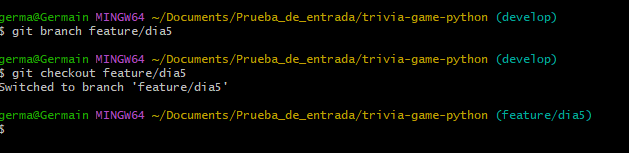
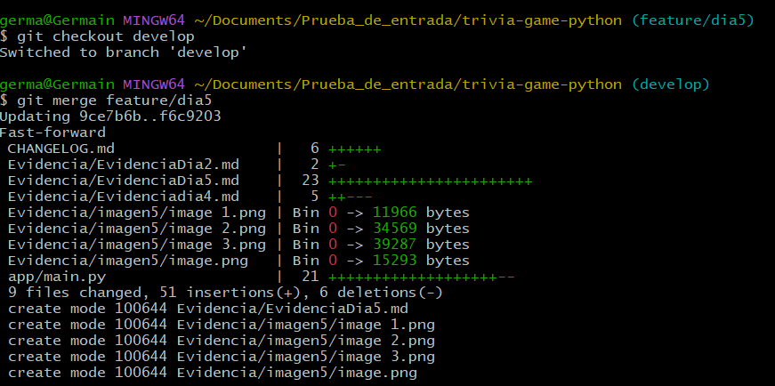

# dia 5
---
[<< Dia 4](Evidenciadia4.md)
---
## 1. creamos la rama `feature/dia5`

una vez crado la rama nos pasamos a la rama 

## 2. Interfaz de la consola

## 3. Prueba de Interfaz y ajuste de mensaje

## 4. Fusionando Ramas

---
[<< Dia 4](Evidenciadia4.md)
---