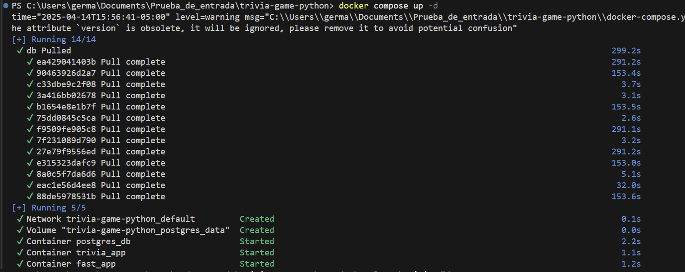

# dia 6
---
[<< Dia 5](EvidenciaDia5.md)
---
# ejecuntando el `docker compose up -d`

## creamos la rama `feature/dia6`

## se crea el archivo `.github/workflows/ci.yml`

---
[<< Dia 5](EvidenciaDia5.md)
---