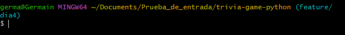

# Dia 4

---
[<< Dia 3](EvidenciaDia3.md)
---

## 1. creamos larama feature/dia4

creamos con el comando `git branch feature/dia4`  y nos cambiamos a a la rama con

`git checkout feature/dia4` 

## 2. implementando el metodo `answer_question` para actualizar la puntuacion

## preparamos y commiteamos el archivo `trivia.py`

## 3. implementando prueba unitaria para la verificacion de puntos

ejecutamos el comando `python -m pytest`

## 4. preparamos el archivo y luego commiteamos

## 5. implementar la funcion `run_quizt` para el flujo de 10 preguntas

esto ya se habia hecho en el `dia 3`

ejecucion del juego

---
[<< Dia 3](EvidenciaDia3.md)
---